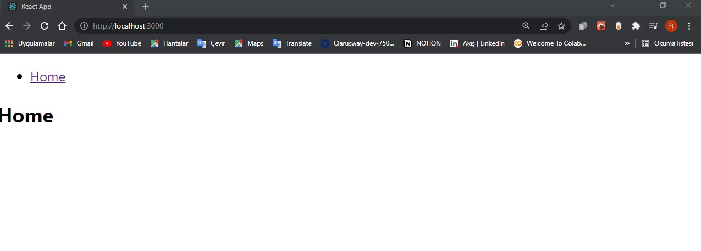
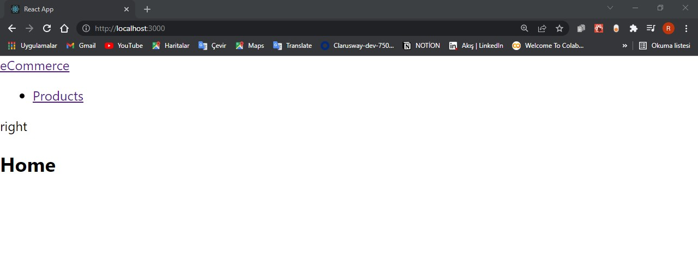
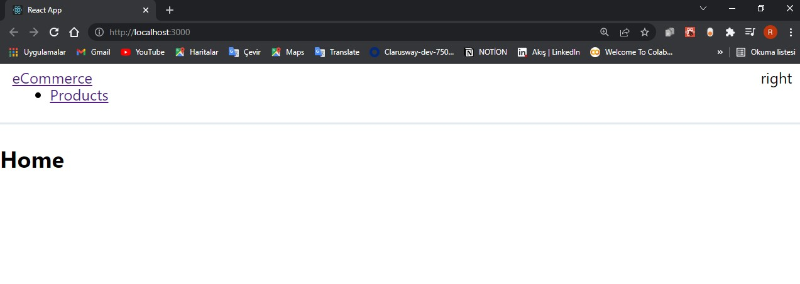
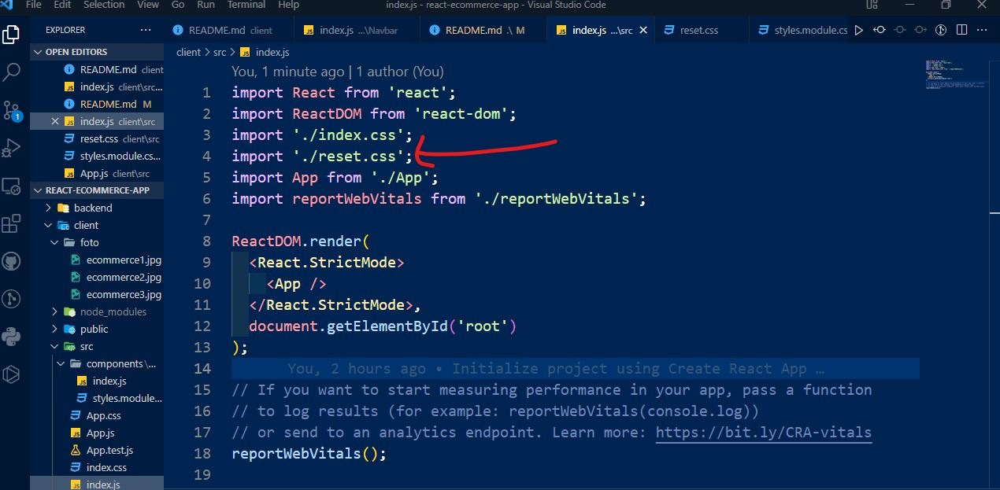
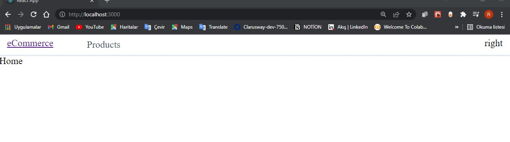
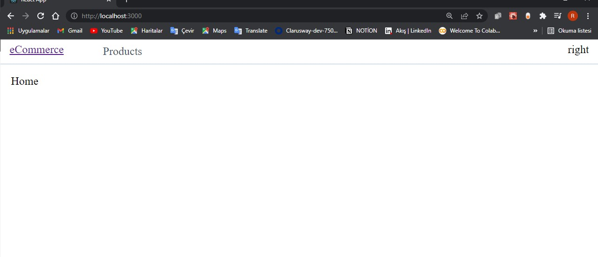
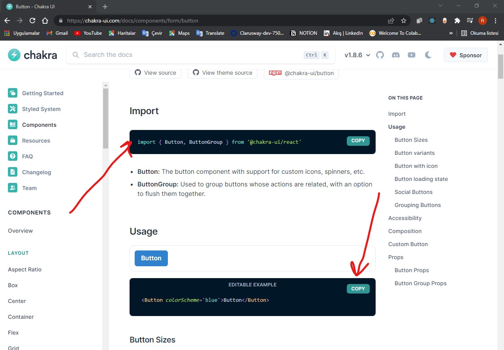
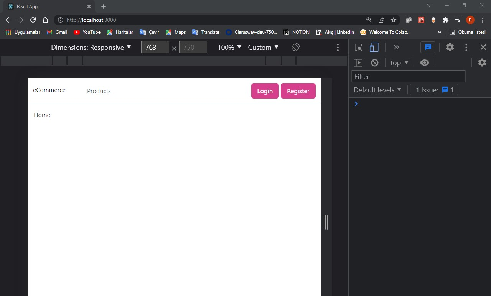

# react-ecommerce-app

    1 git clone https://github.com/SenFaruk/react-ecommerce-app.git
   2 npx create-react-app client
   3 cd .\react-ecommerce-app\
   4 npx create-react-app client
   5 cd client
   6 yarn start

   # react-ecommerce-app

-_-_-_-_-_-_-_-_-_ Chakra UI Kurulumu -_-_-_-_-_-_-_-_-_
UI tarafında chakra uı yı tercih edeceğiz
## https://chakra-ui.com/

App.js içindeki gereksiz tanımları sildim.
öncelikle burada ihtiyacımız olan react routerı kurmamız lazım ve sayfa geçiş işlemlerini bunun üzerinden yapmalıyım
## https://v5.reactrouter.com/web/guides/quick-start girelim

## yarn add react-router-dom
komutu çalıştırdıktan ve kurulum gerçekleştikten sonra ilgili siteden gerekli import ve örneği kopyalıyorum.Switch importunda hata verdi şöyle yaptık:

## yarn add react-router-dom@5.2.0

## App.js

import "./App.css";

import React from "react";
import { BrowserRouter as Router, Switch, Route, Link } from "react-router-dom";

function App() {
  return (
    <Router>
      

        <nav>
          <ul>
            <li>
              <Link to="/">Home</Link>
            </li>
          </ul>
        </nav>

        <Switch>
          <Route path="/" component={Home} />
        </Switch>
      

    </Router>
  );
}

function Home() {
  return <h2>Home</h2>;
}

export default App;

şimdi src dosyasına gidip components adında bir folder oluşturayım.
bunun altınada Navbar dizini açayım onun içindede index.js file ı olsun.
## src/components/Navbar/index.js
rfce kısaltmasıyla Navbar componentimi oluşturdum.App.js içindeki nav tagını kesip bunun içine yarleştirdim.sonra burada Link kulanılıyordu bunu import edeyim. sonrada Navbar ı App.js import edeyim. 

import React from "react";
import { Link } from "react-router-dom";

function Navbar() {
  return (
    <nav>
      <ul>
        <li>
          <Link to="/">Home</Link>
        </li>
      </ul>
    </nav>
  );
}

export default Navbar;

## App.js

import "./App.css";

import React from "react";
import { BrowserRouter as Router, Switch, Route, Link } from "react-router-dom";
import Navbar from "./components/Navbar";

function App() {
  return (
    <Router>
      

        <Navbar />

        <Switch>
          <Route path="/" component={Home} />
        </Switch>
      

    </Router>
  );
}

function Home() {
  return <h2>Home</h2>;
}

export default App;

şu an aynı şekilde görünüyor.
şimdi Navbar da düzeltmeler yapayım.bir takım stil tanımları yapacağız.bizim Navbarımızda bir sol taraf birde sağ taraf olacak

## App.js
import React from "react";
import { Link } from "react-router-dom";

function Navbar() {
  return (
    <nav>
      

        

          <Link to="/">eCommerce</Link>
        

        <ul className="menu">
          <li>
            <Link to="/">Products</Link>
          </li>
        </ul>
      

      
right

    </nav>
  );
}

export default Navbar;

## src/components/Navbar/index.js

import React from "react";
import { Link } from "react-router-dom";

function Navbar() {
  return (
    <nav>
      

        

          <Link to="/">eCommerce</Link>
        

        <ul className="menu">
          <li>
            <Link to="/">Products</Link>
          </li>
        </ul>
      

      
right

    </nav>
  );
}

export default Navbar;

şimdi stillendirme yapalım:
Navbar folderının içinde styles.module.css dosyamı oluşturdum.
## src/components/Navbar/styles.module.css
.nav{
    padding: 13px;
    display: flex;
    justify-content: space-between;
    border-bottom: solid 2px #e2e8f0;
    line-height: 2px;
}

Navbar/index.js fileıma gidip <import styles from "./styles.module.css";> şeklinde css file ımı "styles" şeklinde import ettim.
onuda <<nav className={styles.nav}>> burada kullandım
## src/components/Navbar/index.js
import React from "react";
import { Link } from "react-router-dom";
import styles from "./styles.module.css";

function Navbar() {
  return (
    <nav className={styles.nav}>
      

        

          <Link to="/">eCommerce</Link>
        

        <ul className="menu">
          <li>
            <Link to="/">Products</Link>
          </li>
        </ul>
      

      
right

    </nav>
  );
}

export default Navbar;

baktığım zaman görüldüğ üzere hem sol hemde sağ taraf oluşmuş oldu.
sol ve sağ tarak içinde bir takım ayarlar yapalım

## src/components/Navbar/styles.module.css

.nav {
    padding: 13px;
    display: flex;
    justify-content: space-between;
    border-bottom: solid 2px #e2e8f0;
    line-height: 2px;
}

.nav .left {
    display: flex;
}

.nav .left .menu {
    display: flex;
    margin-left: 40px;
}

.nav .left .menu li a {
    color: #4a5568;
    text-decoration: none;
    font-size: 1.1rem;
    padding: 3px 16px;
    display: block;
    font-size: 16px;

}
 varsayılan yorumlardan kurtulmak için

 ## https://meyerweb.com/eric/tools/css/reset/

 src dizini altına reset.css file ını açıyorum
 https://meyerweb.com/eric/tools/css/reset/ sitesinde kopyalıyorum

sonra bunu src dizini altındaki index.js dosysına import ediyorum.

## src/index.js

## 
## 

artık gereksiz şeylerden kurtulmuş olduk. varsayılan paddingleri sıfırlamış oldu
## src/components/Navbar/styles.module.css
üzerine gelindiğinde hover olunduğunda siyah bir renk verelim

.nav .left .menu li a:hover{
    color: #000

}

şu anda home kısmı ekranda görünüyor.bunuda şöyle değiştirelim.
App.js dosyama geldim Switch tagının bulunduğu kısmı bir div içine alıp,

        <Switch>
          <Route path="/" component={Home} />
        </Switch>

şeklinde düzeltip.App.css içinde buna bir padding verdim.
## App.js
import "./App.css";

import React from "react";
import { BrowserRouter as Router, Switch, Route, Link } from "react-router-dom";
import Navbar from "./components/Navbar";

function App() {
  return (
    <Router>
      

        <Navbar />

        

          <Switch>
            <Route path="/" component={Home} />
          </Switch>
        

      

    </Router>
  );
}

function Home() {
  return <h2>Home</h2>;
}

export default App;
## App.css
#content{
  padding:15px;
}

## 

şimdide sağ taraftaki login ve register buttonlarını yerleştirelim,
## https://chakra-ui.com/ kullanarak
## yarn add @chakra-ui/react @emotion/react @emotion/styled framer-motion

komutu kullanaarak installettim.
bundan sonra provider ı ayarlamam gerekiyor.
## https://chakra-ui.com/guides/getting-started/cra-guide gittim 

import işlemini copyalayıp en diştaki componentimi sarmallıyorum.src/index.js

## src/index.js
import React from "react";
import ReactDOM from "react-dom";
import "./index.css";
import "./reset.css";
import { ChakraProvider } from "@chakra-ui/react";
import App from "./App";
import reportWebVitals from "./reportWebVitals";

ReactDOM.render(
  <React.StrictMode>
    <ChakraProvider>
      <App />
    </ChakraProvider>
  </React.StrictMode>,
  document.getElementById("root")
);

// If you want to start measuring performance in your app, pass a function
// to log results (for example: reportWebVitals(console.log))
// or send to an analytics endpoint. Learn more: https://bit.ly/CRA-vitals
reportWebVitals();
şu anda chakra.ui kuruldu.
Navbar ıma gidip ilgili buttonu ekleyelim
## 

## src/components/Navbar/index.js

import React from "react";
import { Link } from "react-router-dom";
import styles from "./styles.module.css";
import { Button, ButtonGroup } from "@chakra-ui/react";

function Navbar() {
  return (
    <nav className={styles.nav}>
      

        

          <Link to="/">eCommerce</Link>
        

        <ul className={styles.menu}>
          <li>
            <Link to="/">Products</Link>
          </li>
        </ul>
      

      

        <Button colorScheme="pink">Login</Button>
      

    </nav>
  );
}

export default Navbar;

login butonunu koyduk amma sol taraf biraz kaydı gibi oldu
align-items: center; verdim

## src/components/Navbar/styles.module.css

.nav {
    padding: 13px;
    display: flex;
    justify-content: space-between;
    border-bottom: solid 2px #e2e8f0;
    line-height: 2px;
    align-items: center;
}

login i yaptığım gibi birde rgister buttonunu yapmam lazım onuda login i kopyalayıp değiştireyim.şu anda bunların bir link tanımı yok sadece button olarak bulunuyor.bunlara react-router-dom altındaki Link ile sarmamız lazım ki basıldığında başka bir yere gidebilelim.

## src/components/Navbar/index.js

import React from "react";
import { Link } from "react-router-dom";
import styles from "./styles.module.css";
import { Button, ButtonGroup } from "@chakra-ui/react";

function Navbar() {
  return (
    <nav className={styles.nav}>
      

        

          <Link to="/">eCommerce</Link>
        

        <ul className={styles.menu}>
          <li>
            <Link to="/">Products</Link>
          </li>
        </ul>
      

      

        <Link to="/signin">
          <Button colorScheme="pink">Login</Button>
        </Link>
        <Link to="/signup">
          <Button colorScheme="pink">Register</Button>
        </Link>
      

    </nav>
  );
}

export default Navbar;

şimdi buttonlar birbirine yapışık duruyor onları ayıralım.

<
> ı <
> yaptım.
sonra styles.module.css file ına
 <.nav .right a:first-child{
    margin-right: 5px;

} > verelim

## src/components/Navbar/index.js

import React from "react";
import { Link } from "react-router-dom";
import styles from "./styles.module.css";
import { Button, ButtonGroup } from "@chakra-ui/react";

function Navbar() {
  return (
    <nav className={styles.nav}>
      

        

          <Link to="/">eCommerce</Link>
        

        <ul className={styles.menu}>
          <li>
            <Link to="/">Products</Link>
          </li>
        </ul>
      

      

        <Link to="/signin">
          <Button colorScheme="pink">Login</Button>
        </Link>
        <Link to="/signup">
          <Button colorScheme="pink">Register</Button>
        </Link>
      

    </nav>
  );
}

export default Navbar;

## src/components/Navbar/styles.module.css

.nav {
    padding: 13px;
    display: flex;
    justify-content: space-between;
    border-bottom: solid 2px #e2e8f0;
    line-height: 2px;
    align-items: center;
}

.nav .left {
    display: flex;
}

.nav .left .menu {
    display: flex;
    margin-left: 40px;
}

.nav .left .menu li a {
    color: #4a5568;
    text-decoration: none;
    font-size: 1.1rem;
    padding: 3px 16px;
    display: block;
    font-size: 16px;

}

.nav .left .menu li a:hover {
    color: #000
}

.nav .right a:first-child {
    margin-right: 5px;

}

## 

şimdi bu buttonlara basıldığı andada ilgili route lara yönlendirilmesi işlemini yapmaya çalışalım src folder ı altına pages isimli bir folder daha açtım. onun altınada Auth diye bir dizin daha açıyorum ounu altınada Signin ve Signup diye dizinler açıp her birinin altına index.js fileları açıp component isimlerini veriyorum.
## src/pages/Auth/Signin/index.js
import React from "react";

function Signin() {
  return 
Signin
;
}

export default Signin;

## src/pages/Auth/Signup/index.js
import React from "react";

function Signup() {
  return 
Signup
;
}

export default Signup;

şimdi bu rootları getirip tanımlayacağız.nerede tabiki App.js dosyasının içinde
<

          <Switch>
            <Route path="/" exact component={Home} />
            <Route path="/signin" component={Signin} />
            <Route path="/signup" component={Signup} />
          </Switch>
        
> şeklinde tanımladım

## src/components/Navbar/index.js

import "./App.css";

import React from "react";
import { BrowserRouter as Router, Switch, Route, Link } from "react-router-dom";
import Navbar from "./components/Navbar";
import Signin from "./pages/Auth/Signin";
import Signup from "./pages/Auth/Signup";

function App() {
  return (
    <Router>
      

        <Navbar />

        

          <Switch>
            <Route path="/" exact component={Home} />
            <Route path="/signin" component={Signin} />
            <Route path="/signup" component={Signup} />
          </Switch>
        

      

    </Router>
  );
}

function Home() {
  return <h2>Home</h2>;
}

export default App;

## buraya kadar chakra-ui kurduk genel görünümümüzü ana hatlarıyla oluşturduk. bundan sonrada Register için gerekli formumuzu hazırlayacağız ve backend le konuşmaya başlıyacagız.

